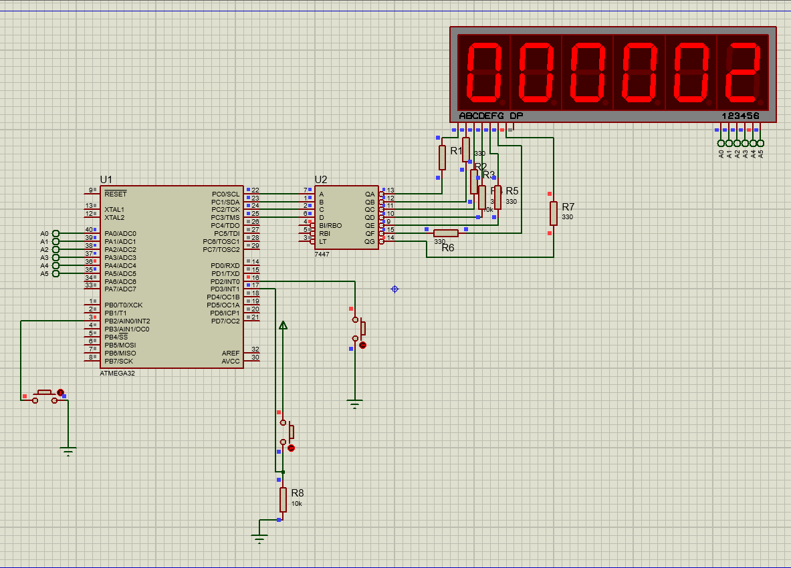

# Stop-Watch

Embedded System Application using External Interrupt, Timer, and 7-Segment Based on C. 

## Description

 System that controls the Stop Watch and displays it on six of 7-segments by using External Interrupts, GPIO, Timer1, and 7-Segment. 

 ***Feature***
    1. Interrupt 0 for Reset the Stop Watch. 
    2. Interrupt 1 for Pause the Stop Watch.
    3. Interrupt 2 for Resume the Stop Watch. 
    4. Timer1 to control the time.

## Getting Started

### Dependencies

* C
* AVR Microcontroller (ATMega32)
* Proteus Software 

### Installing

```
git clone https://github.com/ZiadSheriif/Stop-Watch.git 
```

```
download https://avr-eclipse.sourceforge.net/wiki/index.php/Plugin_Download
```
### Executing program

```
run sim.pdsprj
```

### Screenshots



#### Demo Video


### Contributors

<table>
<tr>
<td align="center">
<a href="https://github.com/ZiadSheriif" target="_black">
<br /><sub><b>ZiadSherif</b></sub></a><br />
</td>
</tr>
 </table>

## License <a name="license"></a>

> This software is licensed under MIT License,
> See [License](https://github.com/ZiadSheriif/Stop-Watch/blob/main/License) for more information ©ZiadSheriif.
